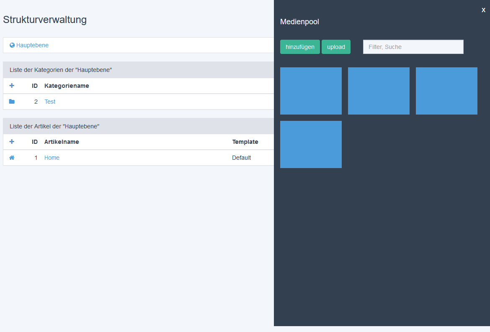

# mediapool_concept
This is a Redaxo 5 concept addon for a new mediapool widget.

## Features
- mediapool widget

## Requirements
- mediapool

## Setup
1. Copy files to addon folder and install through backend

## Usage
You can use the mediapool widget in the backend by click on "Medienpool anzeigen"
